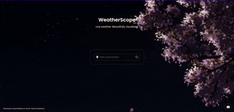

# 🌦️ WeatherScope

A beautiful, responsive Weather App built using **HTML**, **CSS**, and **JavaScript**, powered by the **OpenWeatherMap API** and deployed securely using **Vercel**. This project fetches real-time weather data based on user location or city search, displays relevant information with dynamic visuals, and even allows users to capture a screenshot of the current weather UI.

## ✨ Features

- 🔍 **Search by City Name**

- 📍 **Get Weather by Current Location (Geolocation)**

- 📜 **Recent Search History (via LocalStorage)**

- 📸 **Capture Screenshot of Weather Data (using html2canvas)**

- 🖼️ **Dynamic Weather Icons**

- 🌄 **Dynamic Backgrounds Based on Weather Conditions**

- 💨 **Humidity, Wind, Temperature, and Pressure Display**

- 📱 **Responsive Design for Mobile & Desktop**

- 🔐 **Secure API Key Handling with Serverless Functions (Vercel)**

## 🧠 What I Learned

This is the first project where I worked with a real API, and it has been a wonderful experience. I learned:

- How to use and fetch data from REST APIs
- Integrating search bars and handling user input
- Using `localStorage` in JavaScript to store recent searches
- Working with tools like **Postman** to experiment with APIs
- Leveraging **html2canvas** to take screenshots of the UI
- Setting up and using **serverless functions** to hide API keys
- Deploying a complete full-stack project using **Vercel**

This project gave me a lot of new hands-on experience, and a deeper understanding of frontend development and API integration.

## 🛠️ Tech Stack

- **HTML5**
- **CSS3**
- **Vanilla JavaScript**
- **OpenWeatherMap API**
- **Vercel (Hosting & Serverless API Handling)**
- **html2canvas**
- **Postman (for testing APIs)**

## 🖥️ Desktop Preview



## 📱 Mobile Preview


## 📦 Installation & Setup (For Developers)

1. Clone the Repository : 

    ```bash 
    git clone https://github.com/your-username/weather-app.git
    ```
2. Navigate into the Project Directory:
    ```bash 
    cd weather-app
    ```

## 📄 License

This project is licensed under the MIT License – you're free to use, modify, and distribute it with proper credit.

## 🤝 Feedback & Contributions

I’m always open to feedback, suggestions, or improvements. Feel free to open an issue or fork this repository to contribute. Every bit of feedback helps me learn and grow.